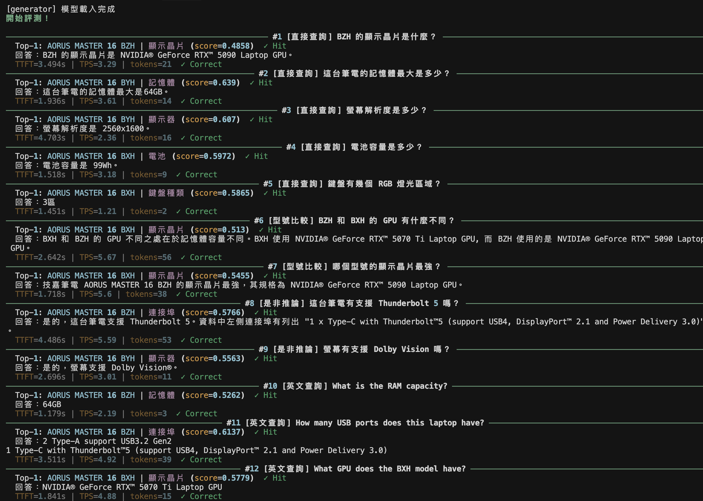
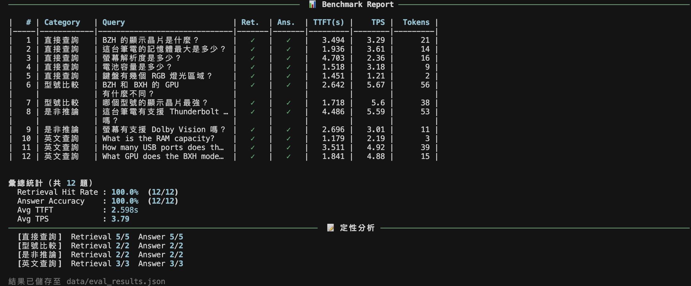

# GIGABYTE AORUS MASTER 16 AM6H RAG Assistant

純 Python 實作的 RAG 問答系統，針對 GIGABYTE AORUS MASTER 16 AM6H 產品規格，支援繁體中文與英文混合查詢。無 LangChain / LlamaIndex，所有 RAG 核心邏輯（Chunking、Retrieval、Generation）皆手寫實作。

---

## 技術架構

```
使用者問題
    │
    ▼
[Retriever] BAAI/bge-m3 embedding → FAISS cosine search → top-3 chunks
    │
    ▼
[Generator] Qwen2.5-3B-Instruct Q4_K_M (llama-cpp-python, Metal)
    │
    ▼
串流輸出回答 + TTFT / TPS 量測
```

| 元件 | 選用 | 說明 |
|------|------|------|
| 推論模型 | Qwen2.5-3B-Instruct Q4_K_M | 4GB VRAM 限制下最佳中文能力 |
| Embedding | BAAI/bge-m3 | 多語言，中英混合表現最佳，跑 CPU |
| Vector Store | faiss-cpu | 純 C++ 後端，輕量高效 |
| 推論引擎 | llama-cpp-python | Apple Metal 加速，支援 Streaming |
| 環境管理 | uv | 快速、可重現的 Python 套件管理 |

---

## 模型選擇理由（4GB VRAM 限制）

### 為什麼選 Qwen2.5-3B-Instruct Q4_K_M？

| 模型 | 量化 | 估計 VRAM | 中文能力 |
|------|------|-----------|---------|
| **Qwen2.5-3B-Instruct** | Q4_K_M (~2.1GB) | **~2GB** | 極佳 |
| Phi-3.5-mini | Q4_K_M (~2.3GB) | ~2.3GB | 普通 |
| Qwen2.5-7B-Instruct | Q4_K_M (~4.6GB) | 超過限制 | 極佳 |

- **Q4_K_M** 是 4-bit 量化中精度與壓縮比的最佳平衡點，品質優於 Q4_0
- Qwen2.5 系列原生支援繁體中文 + 英文，適合本專案混合語系需求
- 2.1GB 模型大小在 4GB VRAM 限制下留有充裕空間給 KV Cache

---

## 快速開始

### 環境安裝

```bash
uv sync
```

### 下載模型

```bash
mkdir -p models
uv run huggingface-cli download Qwen/Qwen2.5-3B-Instruct-GGUF \
  qwen2.5-3b-instruct-q4_k_m.gguf \
  --local-dir models/
```

### 建立向量索引

```bash
uv run python src/chunker.py    # 產生 51 個 chunks
uv run python src/embedder.py   # 建立 FAISS index
```

### 啟動問答系統

```bash
# 互動模式
uv run python src/rag.py

# 單次查詢
uv run python src/rag.py --query "BZH 的顯示晶片是什麼？"

# 調整 retrieve 數量
uv run python src/rag.py --query "..." --top-k 5
```

### 執行評測

```bash
uv run python src/evaluate.py
```

---

## 專案結構

```
gigabyte-rag-assistant/
├── src/
│   ├── chunker.py      # Step 3: 將規格 JSON 切成文字 chunks
│   ├── embedder.py     # Step 4: bge-m3 embedding + 建立 FAISS index
│   ├── retriever.py    # Step 5: cosine similarity 檢索
│   ├── generator.py    # Step 6: llama.cpp 推論 + streaming
│   ├── rag.py          # Step 7: 完整 RAG pipeline 入口
│   └── evaluate.py     # Step 8: 系統評測
├── data/
│   ├── raw/
│   │   └── raw_specs.json      # GIGABYTE 規格資料（3 型號 × 17 規格）
│   ├── chunks/
│   │   └── chunks.json         # 51 個文字 chunks
│   └── index/
│       ├── specs.faiss         # FAISS 向量索引（dim=1024）
│       └── metadata.json       # chunk 對照表
├── models/
│   └── qwen2.5-3b-instruct-q4_k_m.gguf   # 需自行下載
└── pyproject.toml
```

---

## 評測結果（Step 8）

### Demo

**完整問答輸出（12 題）**



**Benchmark Report 彙總**



### 定量指標

| 指標 | 數值 |
|------|------|
| Retrieval Hit Rate | 12/12 (100%) |
| Answer Accuracy | 12/12 (100%) |
| Avg TTFT | 2.598s |
| Avg TPS | 3.79 tokens/s |

### TTFT 與 TPS 計算方式

```
TTFT (Time To First Token)
  = 從送出 prompt 到第一個 token 出現的時間
  = first_token_time - prompt_start_time

TPS (Tokens Per Second)
  = 總產生 token 數 ÷ 總生成時間
```

TTFT 約 2.6s 的原因：模型在輸出第一個字之前，需要先完整處理 prompt（包含 retrieved chunks），此為 prefill 階段的計算時間。

### 定性分析

| 查詢類型 | Retrieval | Answer | 分析 |
|---------|-----------|--------|------|
| 直接查詢（5題）| 5/5 | 5/5 | 單一規格查詢穩定正確 |
| 型號比較（2題）| 2/2 | 2/2 | 跨型號比較能正確區分三個型號差異 |
| 是非推論（2題）| 2/2 | 2/2 | 能正確從規格資料推論是非 |
| 英文查詢（3題）| 3/3 | 3/3 | 中英混合查詢皆正確 |
