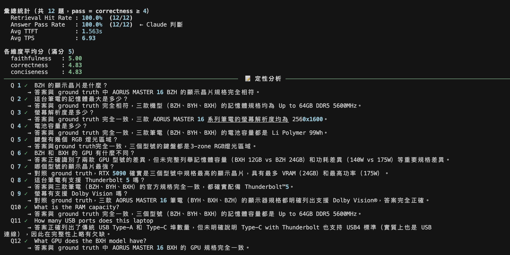
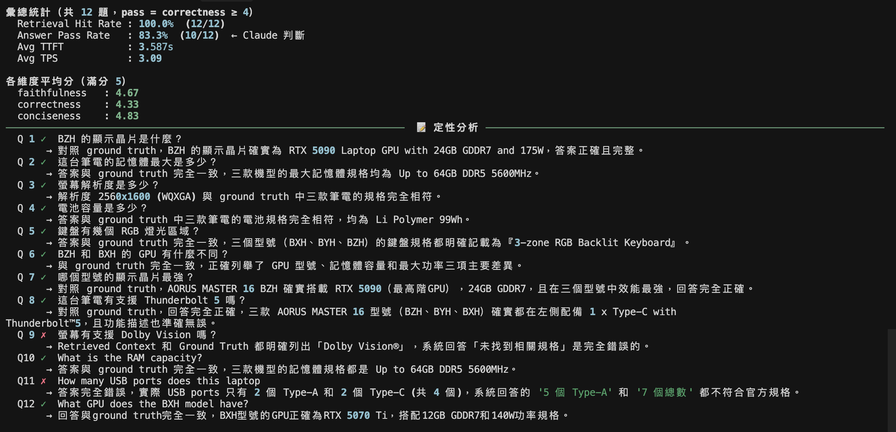

# GIGABYTE AORUS MASTER 16 AM6H RAG Assistant

純 Python 實作的 RAG 問答系統，針對 GIGABYTE AORUS MASTER 16 AM6H 產品規格，支援繁體中文與英文混合查詢。無 LangChain / LlamaIndex，所有 RAG 核心邏輯（Chunking、Retrieval、Generation）皆手寫實作。

---

## 技術架構

```
使用者問題
    │
    ▼
[Retriever] BAAI/bge-m3 embedding → FAISS cosine search → top-3 chunks
    │
    ▼
[Generator] Qwen2.5-3B-Instruct Q4_K_M (llama-cpp-python, Metal)
    │
    ▼
串流輸出回答 + TTFT / TPS 量測
```

| 元件 | 選用 | 說明 |
|------|------|------|
| 推論模型 | Qwen2.5-3B-Instruct Q4_K_M | 4GB VRAM 限制下最佳中文能力 |
| Embedding | BAAI/bge-m3 | 多語言，中英混合表現最佳，跑 CPU |
| Vector Store | faiss-cpu | 純 C++ 後端，輕量高效 |
| 推論引擎 | llama-cpp-python | Apple Metal 加速，支援 Streaming |
| 環境管理 | uv | 快速、可重現的 Python 套件管理 |

---

## 模型選擇理由（4GB VRAM 限制）

### VRAM 估算公式

Q4_K_M 量化的 VRAM 需求可用以下三步驟估算：

```
Step 1: 權重記憶體（bytes）= 參數數量 × 0.55
         Q4_K_M 每個參數約佔 4.5 bits ≈ 0.55 bytes

Step 2: 換算 GB = Step1 結果 ÷ 1,073,741,824

Step 3: 加上 KV Cache / activations / framework overhead
         VRAM 估算 = Step2 × 1.2（保守）~ × 1.5（極保守）
```

**以 Qwen2.5-3B-Instruct Q4_K_M 為例：**

```
Step 1: 3,000,000,000 × 0.55 = 1,650,000,000 bytes
Step 2: 1,650,000,000 ÷ 1,073,741,824 ≈ 1.54 GB
Step 3: 1.54 × 1.2 ≈ 1.84 GB（保守）
        1.54 × 1.5 ≈ 2.31 GB（極保守）
```

實際 .gguf 檔案大小為 2.1 GB，與公式估算吻合。

### 為什麼選 Qwen2.5-3B-Instruct Q4_K_M？

| 模型 | 量化 | 每參數 bytes | 權重 GB | 估算 VRAM（×1.2） | 中文能力 | 備註 |
|------|------|------------|---------|-----------------|---------|------|
| **Qwen2.5-3B Q4_K_M** ← 現用 | Q4_K_M | 0.55 | 1.54 | **1.84 GB** | ★★★★★ | 最佳平衡 |
| Qwen2.5-7B Q3_K_S | Q3_K_S | 0.38 | 2.42 | **2.90 GB** | ★★★★★ | 更強但需激進量化 |
| Phi-3.5-mini (3.8B) Q4_K_M | Q4_K_M | 0.55 | 1.95 | **2.34 GB** | ★★★☆☆ | 英文推理強，中文偏弱 |
| Gemma-3-4B Q4_K_M | Q4_K_M | 0.55 | 2.05 | **2.46 GB** | ★★★☆☆ | 多語言尚可，中文不如 Qwen |
| Qwen2.5-1.5B Q4_K_M | Q4_K_M | 0.55 | 0.77 | **0.92 GB** | ★★★★☆ | 極輕量，回答深度不足 |
| Qwen2.5-7B Q4_K_M | Q4_K_M | 0.55 | 3.58 | **4.29 GB** | ★★★★★ | 超出 4GB 限制 |

- **Q4_K_M** 是 4-bit 量化中精度與壓縮比的最佳平衡點，品質優於 Q4_0
- Qwen2.5 系列原生支援繁體中文 + 英文，適合本專案混合語系需求
- 1.84 GB 估算 VRAM 在 4GB 限制下留有充裕空間給 KV Cache
- 若想升級效果：`Qwen2.5-7B Q3_K_S`（2.90 GB）是最值得嘗試的替代方案

---

## 快速開始

### 環境安裝

```bash
uv sync
```

### 下載模型

```bash
mkdir -p models
uv run huggingface-cli download Qwen/Qwen2.5-3B-Instruct-GGUF \
  qwen2.5-3b-instruct-q4_k_m.gguf \
  --local-dir models/
```

### 建立向量索引

```bash
uv run python src/chunker.py    # 產生 51 個 chunks
uv run python src/embedder.py   # 建立 FAISS index
```

### 啟動問答系統

```bash
# 互動模式
uv run python src/rag.py

# 單次查詢
uv run python src/rag.py --query "BZH 的顯示晶片是什麼？"

# 調整 retrieve 數量
uv run python src/rag.py --query "..." --top-k 5
```

### 執行評測

```bash
uv run python src/evaluate.py            # 3B 模型（預設）
uv run python src/evaluate.py --model 7b # 7B 模型
```

### LLM Judge（Claude API 自動評分）

設定 API Key：

```bash
cp .env.example .env
# 編輯 .env，填入你的 ANTHROPIC_API_KEY
```

**方式一：對已有的 eval 結果補充評分（`llm_judge.py`）**

```bash
uv run python src/llm_judge.py --input data/eval_results_3b.json
uv run python src/llm_judge.py --input data/eval_results_7b.json
```

**方式二：直接跑 RAG + Claude 即時評分（`evaluate_judge.py`）**

支援 `--judge-mode` 參數選擇評分機制：

```bash
# binary 模式（預設）：correct / incorrect + 一句理由
uv run python src/evaluate_judge.py --model 3b
uv run python src/evaluate_judge.py --model 7b

# score 模式：三維度 1-5 分（faithfulness / correctness / conciseness）
uv run python src/evaluate_judge.py --model 3b --judge-mode score
uv run python src/evaluate_judge.py --model 7b --judge-mode score
```

Ground truth 來源為 `data/raw/raw_specs.json`（完整官方規格），pass 條件為 correctness ≥ 4。
輸出儲存至 `data/judge_results_{model}_{mode}.json`，包含每題評分與彙總統計。

---

## 專案結構

```
gigabyte-rag-assistant/
├── src/
│   ├── chunker.py      # Step 3: 將規格 JSON 切成文字 chunks
│   ├── embedder.py     # Step 4: bge-m3 embedding + 建立 FAISS index
│   ├── retriever.py    # Step 5: cosine similarity 檢索
│   ├── generator.py    # Step 6: llama.cpp 推論 + streaming
│   ├── rag.py              # Step 7: 完整 RAG pipeline 入口
│   ├── evaluate.py         # Step 8: 系統評測（關鍵字比對）
│   ├── llm_judge.py        # LLM Judge: 對已有 eval 結果補充評分
│   └── evaluate_judge.py   # LLM Judge: RAG + Claude 即時評分（binary / score）
├── data/
│   ├── raw/
│   │   └── raw_specs.json      # GIGABYTE 規格資料（3 型號 × 17 規格）
│   ├── chunks/
│   │   └── chunks.json         # 51 個文字 chunks
│   └── index/
│       ├── specs.faiss         # FAISS 向量索引（dim=1024）
│       └── metadata.json       # chunk 對照表
├── models/
│   └── qwen2.5-3b-instruct-q4_k_m.gguf   # 需自行下載
└── pyproject.toml
```

---

## 評測結果（Step 8）

### Demo

**完整問答輸出（12 題）**


**Benchmark Report 彙總**


### 定量指標

| 指標 | 數值 |
|------|------|
| Retrieval Hit Rate | 12/12 (100%) |
| Answer Accuracy | 12/12 (100%) |
| Avg TTFT | 2.598s |
| Avg TPS | 3.79 tokens/s |

### TTFT 與 TPS 計算方式

```
TTFT (Time To First Token)
  = 從送出 prompt 到第一個 token 出現的時間
  = first_token_time - prompt_start_time

TPS (Tokens Per Second)
  = 總產生 token 數 ÷ 總生成時間
```

TTFT 約 2.6s 的原因：模型在輸出第一個字之前，需要先完整處理 prompt（包含 retrieved chunks），此為 prefill 階段的計算時間。

### 定性分析

| 查詢類型 | Retrieval | Answer | 分析 |
|---------|-----------|--------|------|
| 直接查詢（5題）| 5/5 | 5/5 | 單一規格查詢穩定正確 |
| 型號比較（2題）| 2/2 | 2/2 | 跨型號比較能正確區分三個型號差異 |
| 是非推論（2題）| 2/2 | 2/2 | 能正確從規格資料推論是非 |
| 英文查詢（3題）| 3/3 | 3/3 | 中英混合查詢皆正確 |

---

## 3B vs 7B 模型比較（feature/7b-model-eval）

### 指令

```bash
uv run python src/evaluate.py --model 3b   # Qwen2.5-3B Q4_K_M（預設）
uv run python src/evaluate.py --model 7b   # Qwen2.5-7B Q3_K_M
```

### 定量比較

| 指標 | 3B Q4_K_M | 7B Q3_K_M |
|------|-----------|-----------|
| Retrieval Hit Rate | 12/12 (100%) | 12/12 (100%) |
| Answer Accuracy | 12/12 (100%) | 11/12 (91.7%) |
| Avg TTFT | 2.598s | ~10s |
| Avg TPS | 3.79 tokens/s | ~0.65 tokens/s |

### Q9 Dolby Vision 失敗分析（7B Q3_K_M 已知限制）

**現象：** Q9「螢幕有支援 Dolby Vision 嗎？」中，Retrieval 正確命中（三個型號的 `顯示器` 欄位，score ≈ 0.55），chunks 內文明確包含「Dolby Vision®」，但 7B Q3_K_M 回答「資料中未找到相關規格。」

**3B Q4_K_M 表現正常**，相同 chunks 下能正確回答。

**可能原因：Q3_K_M 量化精度不足**

每個顯示器規格文字約含 **13 個逗號分隔的屬性**，「Dolby Vision®」位於最末端：

```
16" 16:10, OLED WQXGA (2560x1600) 240Hz, 1ms, DCI-P3 100%, 500nits, 
1,000,000:1, G-SYNC®, Advanced Optimus, DisplayHDR True Black 500, 
ClearMR 10000, Pantone® Validated, TÜV Low Blue Light, Dolby Vision®
```

Q3_K_M 將權重壓縮至約 3.5 bits/param（vs Q4_K_M 的 4.5 bits）。在長序列末端，注意力機制所需的精度不足，導致模型對序列尾端的 token 產生理解偏差，誤判「資料中無相關資訊」。這是一個典型的**量化 + 長文本尾端衰減**問題，3B Q4_K_M 因量化精度較高反而表現更好。

---

## LLM as a Judge 評測結果（feature/llm-judge）

使用 Claude Haiku 作為評審，Ground Truth 為 `raw_specs.json` 完整規格資料。

### 3B Q4_K_M — Score 模式



### 7B Q3_K_M — Score 模式



### LLM Judge 設計重點

| 項目 | 說明 |
|------|------|
| Judge 模型 | Claude Haiku（`claude-haiku-4-5-20251001`） |
| Ground Truth | `data/raw/raw_specs.json` 完整官方規格（非手寫答案） |
| Binary 模式 | correct / incorrect + 一句理由 |
| Score 模式 | faithfulness / correctness / conciseness 各 1-5 分，correctness ≥ 4 為 pass |
| 輸出格式 | JSON 含 `summary`（彙總統計）與 `results`（每題明細） |
